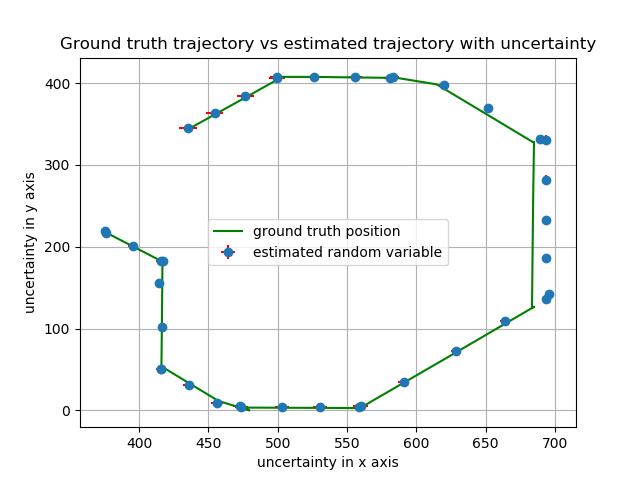
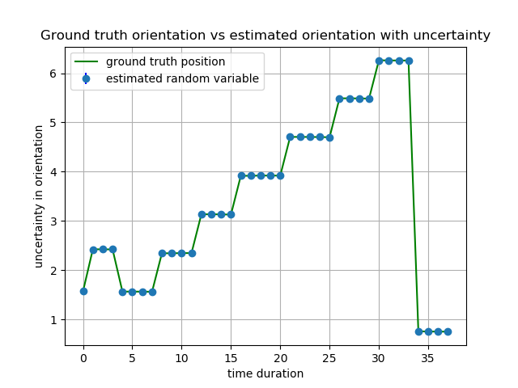
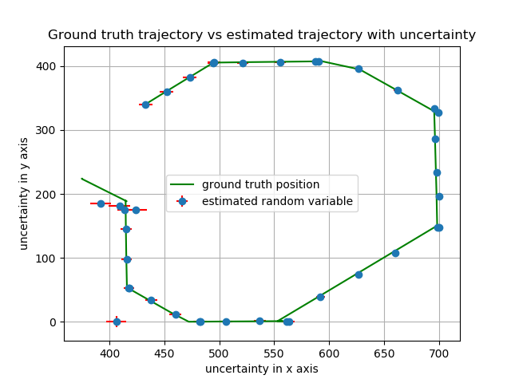
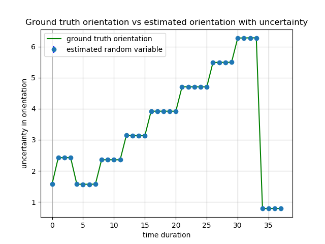

# EE209AS (Fall 2018)
### Problem set 3	Instructor: Prof. Ankur Mehta
### Team Member: Ray Lin, Pengrui Quan

### Objective
To explore Kalman Filtering (KF) to estimate the state of a simple two-wheeled robot

### Experiment results

Estimated location and orientation with low uncertainty initialized. For more intuitive illustration, please refer to our animation **Known inital position.mp4** of the distribution of random varaibles.

Estimated location and orientation with high uncertainty initialized. For more intuitive illustration, please refer to our animation **Unknown inital position.mp4** of the distribution of random varaibles.

### Instructions on running the code:
	
	please go to the main function of the code, initialize the characteristic of the robot with robot(state_mean, state_cov, gt_state), and call test functions, such as test_case2(robot), test_case3(robot), and test_case4(robot)

